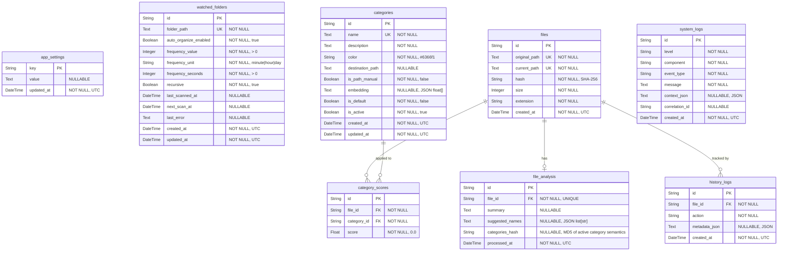

# Database Schema

Klin-Worker v0.2.0 uses a local **SQLite** database (`~/.klin/klin.db`) via SQLAlchemy async + aiosqlite.

All primary keys are **UUID v4** strings. Timestamps are **UTC ISO-8601**.

---

## ER Diagram

### Mermaid



---

## Tables

### `app_settings`

Key-value store for application-wide settings (e.g. default base path).

| Column       | Type       | Constraints | Default | Description                          |
| ------------ | ---------- | ----------- | ------- | ------------------------------------ |
| `key`        | `String`   | **PK**      | —       | Setting identifier                   |
| `value`      | `Text`     | NULLABLE    | `NULL`  | Setting value                        |
| `updated_at` | `DateTime` | NOT NULL    | UTC now | Last modification timestamp          |

**Known keys:**

| Key                           | Example value                      | Description |
| ----------------------------- | ---------------------------------- | ----------- |
| `default_base_path`           | `/Users/sarun/KlinFiles`           | Base folder. Auto-applied to categories where `is_path_manual=false`. |
| `auto_organize_master_enabled`| `true`                             | Global Auto Organizing master toggle used by settings UI. |
| `onboarding_status`           | `pending` / `base_path_set` / `completed` | First-run onboarding state machine (seed completion is tracked separately). |
| `onboarding_seeded`           | `true` / `false`                   | Whether default category seeding has completed at least once. |
| `onboarding_started_at`       | `2026-03-16T09:58:00+00:00`        | Timestamp when onboarding first started. |
| `onboarding_seeded_at`        | `2026-03-16T09:58:04+00:00`        | Timestamp when default category seed completed. |
| `onboarding_completed_at`     | `2026-03-16T09:58:05+00:00`        | Timestamp when onboarding was marked complete. |
| `seed_version`                | `1`                                | Seed data version marker for future seed migrations. |
| `lock_file`                   | `["C:\\path\\a.pdf"]`            | JSON list of absolute file paths excluded from AI processing. |
| `lock_folder`                 | `["C:\\Users\\me\\Secret"]`     | JSON list of absolute folder paths excluded from AI processing (applies to descendants). |

---

### `watched_folders`

Persistent per-folder configuration for Auto Organizing.

| Column                  | Type         | Constraints                     | Default  | Description |
| ----------------------- | ------------ | ------------------------------- | -------- | ----------- |
| `id`                    | `String`     | **PK**                          | UUID v4  | Unique watcher identifier |
| `folder_path`           | `Text`       | NOT NULL, UNIQUE                | —        | Absolute folder path being watched |
| `auto_organize_enabled` | `Boolean`    | NOT NULL                        | `true`   | Per-folder enable/disable switch |
| `frequency_value`       | `Integer`    | NOT NULL, CHECK `> 0`           | `1`      | User-facing cadence value (e.g. `1`) |
| `frequency_unit`        | `String(16)` | NOT NULL, CHECK in `minute/hour/day` | `day` | User-facing cadence unit |
| `frequency_seconds`     | `Integer`    | NOT NULL, CHECK `> 0`           | `86400`  | Scheduler-friendly derived cadence |
| `recursive`             | `Boolean`    | NOT NULL                        | `true`   | Whether subdirectories are included |
| `last_scanned_at`       | `DateTime`   | NULLABLE                        | `NULL`   | Last successful scan timestamp |
| `next_scan_at`          | `DateTime`   | NULLABLE                        | `NULL`   | Next due scan timestamp |
| `last_error`            | `Text`       | NULLABLE                        | `NULL`   | Latest watcher error (if any) |
| `created_at`            | `DateTime`   | NOT NULL                        | UTC now  | Row creation timestamp |
| `updated_at`            | `DateTime`   | NOT NULL                        | UTC now  | Last modification timestamp |

**Indexes/constraints:**

- Unique constraint on `folder_path`
- Composite index `ix_watched_folders_enabled_next_scan` on (`auto_organize_enabled`, `next_scan_at`)
- Check constraints enforce positive frequency and valid `frequency_unit`

---

### `categories`

User-defined classification buckets. Each category has an embedding vector used for cosine-similarity scoring against files.

| Column             | Type         | Constraints             | Default          | Description                                  |
| ------------------ | ------------ | ----------------------- | ---------------- | -------------------------------------------- |
| `id`               | `String`     | **PK**                  | UUID v4          | Unique identifier                            |
| `name`             | `Text`       | NOT NULL, UNIQUE        | —                | Display name (e.g. "Invoices")               |
| `description`      | `Text`       | NOT NULL                | `""`             | Human description used for embedding. Can contain natural language plus comma-separated keywords or phrases. |
| `color`            | `String(7)`  | NOT NULL                | `"#6366f1"`      | Hex color for UI display                     |
| `destination_path` | `Text`       | NULLABLE                | `NULL`           | Target folder for organized files. Auto-set from `default_base_path/{name}` unless manual. |
| `is_path_manual`   | `Boolean`    | NOT NULL                | `false`          | `true` when user explicitly set `destination_path`. Auto-update from base path is skipped. |
| `embedding`        | `Text`       | NULLABLE                | `NULL`           | JSON-serialised float list (model-dependent; default model uses 2048 dims) |
| `is_default`       | `Boolean`    | NOT NULL                | `false`          | `true` for system-seeded categories. User-created categories are `false`. |
| `is_active`        | `Boolean`    | NOT NULL                | `true`           | Soft-delete / disable toggle                 |
| `created_at`       | `DateTime`   | NOT NULL                | UTC now          | Row creation timestamp                       |
| `updated_at`       | `DateTime`   | NOT NULL                | UTC now          | Last modification timestamp (auto-updated)   |

**Embedding source text:**

The embedding vector is generated from `name + description`. The `description` field may include both natural-language guidance and keyword-style phrases for broader semantic coverage. This is handled by `_build_embed_text()` in `seed_service.py`.

**Default categories:**

Default categories are seeded via `PUT /api/settings/default-base-path` (called by Tauri on launch) when the categories table is empty. Embeddings are generated in the same request if llama.cpp and RAG are ready.

**Relationships:**

- `scores` → `CategoryScore[]` (cascade delete)

---

### `files`

Scanned file metadata. One row per unique file path.

| Column          | Type         | Constraints             | Default  | Description                          |
| --------------- | ------------ | ----------------------- | -------- | ------------------------------------ |
| `id`            | `String`     | **PK**                  | UUID v4  | Unique identifier                    |
| `original_path` | `Text`       | NOT NULL, UNIQUE        | —        | Absolute path on disk                |
| `current_path`  | `Text`       | NOT NULL, UNIQUE        | —        | Current file path tracked by the backend after a confirmed rename/move selection |
| `hash`          | `String(64)` | NOT NULL                | —        | SHA-256 content hash                 |
| `size`          | `Integer`    | NOT NULL                | —        | File size in bytes                   |
| `extension`     | `String(32)` | NOT NULL                | —        | File extension (e.g. `.pdf`, `.png`) |
| `created_at`    | `DateTime`   | NOT NULL                | UTC now  | Row creation timestamp               |

**Relationships:**

- `analysis` → `FileAnalysis` (1:1, cascade delete)
- `scores` → `CategoryScore[]` (1:N, cascade delete)
- `history` → `HistoryLog[]` (1:N, cascade delete)

---

### `file_analysis`

AI-generated summary and rename suggestions for a file. One row per file.

| Column            | Type       | Constraints                      | Default  | Description                                        |
| ----------------- | ---------- | -------------------------------- | -------- | -------------------------------------------------- |
| `id`              | `String`   | **PK**                           | UUID v4  | Unique identifier                                  |
| `file_id`         | `String`   | **FK → files.id**, NOT NULL, UQ  | —        | Associated file                                    |
| `summary`         | `Text`     | NULLABLE                         | `NULL`   | One-paragraph AI-generated summary                 |
| `suggested_names` | `Text`     | NULLABLE                         | `NULL`   | JSON-serialised `list[str]` of filename suggestions |
| `categories_hash` | `String`   | NULLABLE                         | `NULL`   | MD5 of active category semantics (`id + name + description`) at analysis time. `NULL` triggers a one-time re-classification. |
| `processed_at`    | `DateTime` | NOT NULL                         | UTC now  | When the analysis was generated                    |

**Cache invalidation:**

The organize pipeline computes `MD5(sorted active category id:name:description tuples)` on every request and compares it to `categories_hash`:

| `file_changed` | `categories_hash` matches | `force` | Result |
|---|---|---|---|
| `false` | ✅ yes | `false` | **Full hit** — return DB cache instantly (<150 ms) |
| `false` | ❌ no / `NULL` | `false` | **Partial** — re-classify only (~2 s, no LLM summary call) |
| `true` | any | any | **Full pipeline** (~5 s) |
| any | any | `true` | **Full pipeline** (forced) |

**Relationships:**

- `file` → `File` (N:1)

**On delete:** Cascades when parent `File` is deleted.

---

### `category_scores`

AI classification score for each file × category pair. Represents how well a file matches a category based on cosine similarity of embeddings.

| Column        | Type     | Constraints                    | Default  | Description                              |
| ------------- | -------- | ------------------------------ | -------- | ---------------------------------------- |
| `id`          | `String` | **PK**                         | UUID v4  | Unique identifier                        |
| `file_id`     | `String` | **FK → files.id**, NOT NULL    | —        | Associated file                          |
| `category_id` | `String` | **FK → categories.id**, NOT NULL | —      | Associated category                      |
| `score`       | `Float`  | NOT NULL                       | `0.0`    | Cosine similarity score (0.0 – 1.0)     |

**Relationships:**

- `file` → `File` (N:1)
- `category` → `Category` (N:1)

**On delete:** Cascades when parent `File` or `Category` is deleted.

---

### `history_logs`

Append-only audit trail of every action performed on a file. Analysis events (`organized*`) still store AI score snapshots, while user-confirmed actions (`renamed`, `moved`, `renamed_moved`) store the selected category and resulting paths.

| Column          | Type         | Constraints                  | Default  | Description                                  |
| --------------- | ------------ | ---------------------------- | -------- | -------------------------------------------- |
| `id`            | `String`     | **PK**                       | UUID v4  | Unique identifier                            |
| `file_id`       | `String`     | **FK → files.id**, NOT NULL  | —        | Associated file                              |
| `action`        | `String(64)` | NOT NULL                     | —        | Action type (e.g. `"organized"`)              |
| `metadata_json` | `Text`       | NULLABLE                     | `NULL`   | JSON snapshot — see convention below         |
| `created_at`    | `DateTime`   | NOT NULL                     | UTC now  | When the action occurred                     |

**Relationships:**

- `file` → `File` (N:1)

**On delete:** Cascades when parent `File` is deleted.

#### `metadata_json` conventions

##### `action = "organized"`

บันทึกเมื่อ `/api/organize` ทำงานสำเร็จ — เก็บ snapshot ของ score ทั้งหมด ณ เวลานั้น

```json
{
  "suggested_names": ["tcm_curriculum_cm67.pdf", "traditional_medicine_cm67.pdf"],
  "all_scores": [
    { "category_id": "a1b2c3d4-...", "name": "Education & Research", "score": 0.86 },
    { "category_id": "e5f6g7h8-...", "name": "Health & Medical", "score": 0.82 }
  ]
}
```

##### `action = "organized"` — ไม่มี category

กรณีที่ user ยังไม่ได้สร้าง category ไว้เลย ระบบยังคง scan + summary + rename ได้ แต่ไม่มี score

```json
{
  "suggested_names": ["meeting_notes_feb_2026.docx"],
  "all_scores": []
}
```

##### `action = "organized"` — เกิด error ระหว่าง processing

กรณีไฟล์ scan ไม่ผ่าน (เช่น file not found, permission denied) จะไม่มี history log เพราะไม่มี `file_id` — error จะส่งกลับใน response field `error` ของ `OrganizeFileResult` แทน

##### `action = "category_created"`

(สำหรับอนาคต) บันทึกเมื่อ user สร้าง category ใหม่

```json
{
  "category_id": "a1b2c3d4-...",
  "name": "Invoices",
  "description": "Tax invoices, receipts, billing documents"
}
```

##### `action = "category_updated"`

(สำหรับอนาคต) บันทึกเมื่อ user แก้ไข category

```json
{
  "category_id": "a1b2c3d4-...",
  "changes": {
    "name": { "old": "Bills", "new": "Invoices" },
    "description": { "old": "Billing docs", "new": "Tax invoices, receipts, billing documents" }
  }
}
```

##### `action = "category_deleted"`

(สำหรับอนาคต) บันทึกเมื่อ user ลบ category

```json
{
  "category_id": "a1b2c3d4-...",
  "name": "Old Category"
}
```

##### `action = "renamed" | "moved" | "renamed_moved"`

บันทึกเมื่อ user ยืนยัน rename และ/หรือ move หลังจากได้รับผลลัพธ์จาก `/api/organize`

```json
{
  "file_name": "invoice_march_2026.pdf",
  "source_path": "/Users/sarun/Downloads/invoice.pdf",
  "selected_category": {
    "id": "a1b2c3d4-...",
    "name": "Finance",
    "score": 93.0
  },
  "new_path": "/Users/sarun/KlinFiles/Finance/invoice_march_2026.pdf"
}
```

---

#### Quick reference

| `action`             | เมื่อไหร่                    | `metadata_json` มีอะไร                        |
| -------------------- | ---------------------------- | ---------------------------------------------- |
| `organized`          | `/api/organize` สำเร็จ (full run) | `suggested_names[]`, `all_scores[]`       |
| `organized_cached`   | `/api/organize` cache full hit | `suggested_names[]`, `all_scores[]`, `pipeline`, `timings` |
| `organized_reclassified` | `/api/organize` partial (categories changed) | `suggested_names[]`, `all_scores[]`, `pipeline`, `timings` |
| `renamed`            | user ยืนยัน rename อย่างเดียว | `file_name`, `source_path`, `new_path` |
| `moved`              | user ยืนยัน move อย่างเดียว | `file_name`, `source_path`, `selected_category{id,name,score}`, `new_path` |
| `renamed_moved`      | user ยืนยัน rename + move | `file_name`, `source_path`, `selected_category{id,name,score}`, `new_path` |
| `category_created`   | สร้าง category ใหม่           | `category_id`, `name`, `description`           |
| `category_updated`   | แก้ไข category               | `category_id`, `changes`                       |
| `category_deleted`   | ลบ category                  | `category_id`, `name`                          |

> **Note:** `category_scores` stores the **latest** AI score state. `history_logs` stores either AI score snapshots (`organized*`) or user-confirmed action snapshots (`renamed*`, `moved*`).

---

### `system_logs`

Operational / application logs used for startup diagnostics, warnings, and troubleshooting. This table is intentionally separate from `history_logs`: `history_logs` is per-file audit history, while `system_logs` is app-level telemetry.

| Column           | Type         | Constraints     | Default  | Description |
| ---------------- | ------------ | --------------- | -------- | ----------- |
| `id`             | `String`     | **PK**          | UUID v4  | Unique identifier |
| `level`          | `String(16)` | NOT NULL        | —        | Log level (`INFO`, `WARNING`, `ERROR`) |
| `component`      | `String(64)` | NOT NULL        | —        | Source such as `app.lifecycle` or `organize.pipeline` |
| `event_type`     | `String(64)` | NOT NULL        | —        | Stable event key such as `app_startup` |
| `message`        | `Text`       | NOT NULL        | —        | Human-readable summary |
| `context_json`   | `Text`       | NULLABLE        | `NULL`   | Structured JSON context for diagnostics |
| `correlation_id` | `String(64)` | NULLABLE        | `NULL`   | Optional identifier for correlating related events |
| `created_at`     | `DateTime`   | NOT NULL        | UTC now  | Event timestamp |

**Retention:** `system_logs` are pruned on startup using `KLIN_SYSTEM_LOG_RETENTION_DAYS` (default 30 days).
