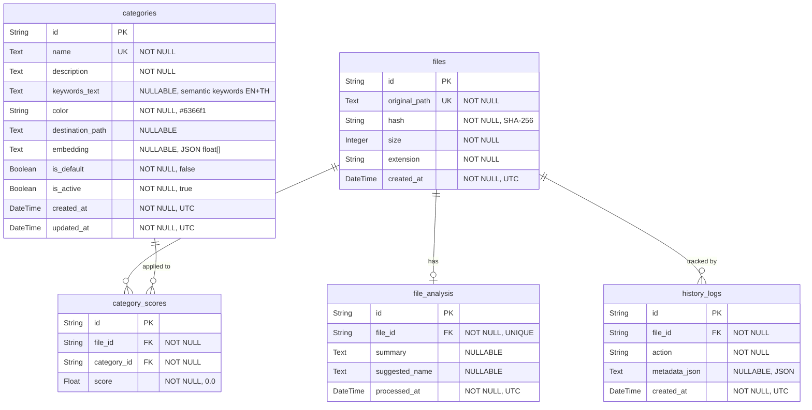

# Database Schema

Klin-Worker v0.2.0 uses a local **SQLite** database (`~/.klin/klin.db`) via SQLAlchemy async + aiosqlite.

All primary keys are **UUID v4** strings. Timestamps are **UTC ISO-8601**.

---

## ER Diagram

### Mermaid



### ASCII

```
┌──────────────┐       ┌─────────────────┐       ┌──────────────────┐
│  categories  │       │      files      │       │  file_analysis   │
├──────────────┤       ├─────────────────┤       ├──────────────────┤
│ id (PK)      │       │ id (PK)         │──1:1──│ file_id (FK)     │
│ name         │       │ original_path   │       │ id (PK)          │
│ description  │       │ hash            │       │ summary          │
│ keywords_text│       │ size            │       │ suggested_name   │
│ color        │       │ extension       │       │ processed_at     │
│ dest_path    │       │ created_at      │       └──────────────────┘
│ embedding    │       └────────┬────────┘
│ is_default   │                │
│ is_active    │                │ 1:N
│ created_at   │                │
│ updated_at   │                │
└───────┬──────┘                │
        │              ┌───────────────────┐
        │   N:1        │  category_scores  │
        └──────────────│ category_id (FK)  │
                       │ file_id (FK)      │
                       │ id (PK)           │
                       │ score             │
                       └───────────────────┘

                       ┌───────────────────┐
          files 1:N    │   history_logs    │
          ─────────────│ file_id (FK)      │
                       │ id (PK)           │
                       │ action            │
                       │ metadata_json     │
                       │ created_at        │
                       └───────────────────┘
```

---

## Tables

### `categories`

User-defined classification buckets. Each category has an embedding vector used for cosine-similarity scoring against files.

| Column             | Type         | Constraints             | Default          | Description                                  |
| ------------------ | ------------ | ----------------------- | ---------------- | -------------------------------------------- |
| `id`               | `String`     | **PK**                  | UUID v4          | Unique identifier                            |
| `name`             | `Text`       | NOT NULL, UNIQUE        | —                | Display name (e.g. "Invoices")               |
| `description`      | `Text`       | NOT NULL                | `""`             | Human description used for embedding          |
| `keywords_text`    | `Text`       | NULLABLE                | `NULL`           | Semantic keywords blob (EN + TH + doc hints). Combined with name + description for richer embeddings. |
| `color`            | `String(7)`  | NOT NULL                | `"#6366f1"`      | Hex color for UI display                     |
| `destination_path` | `Text`       | NULLABLE                | `NULL`           | Optional target folder for organized files   |
| `embedding`        | `Text`       | NULLABLE                | `NULL`           | JSON-serialised float list (768-dim vector)  |
| `is_default`       | `Boolean`    | NOT NULL                | `false`          | `true` for system-seeded categories (12 defaults). User-created categories are `false`. |
| `is_active`        | `Boolean`    | NOT NULL                | `true`           | Soft-delete / disable toggle                 |
| `created_at`       | `DateTime`   | NOT NULL                | UTC now          | Row creation timestamp                       |
| `updated_at`       | `DateTime`   | NOT NULL                | UTC now          | Last modification timestamp (auto-updated)   |

**Embedding source text:**

The embedding vector is generated from `"{name}. {description}. {keywords_text}"` — combining all three fields gives the vector broad semantic coverage for classification. This is handled by `_build_embed_text()` in `seed_service.py`.

**Default categories:**

12 categories are seeded on first boot via `seed_service.py` (idempotent — seeds when the categories table is empty OR when no `is_default=True` rows exist). Embeddings for seeded categories are generated immediately after RAG initialises, but only if llama.cpp is reachable (verified by `startup_checks.py`).

**Relationships:**

- `scores` → `CategoryScore[]` (cascade delete)

---

### `files`

Scanned file metadata. One row per unique file path.

| Column          | Type         | Constraints             | Default  | Description                          |
| --------------- | ------------ | ----------------------- | -------- | ------------------------------------ |
| `id`            | `String`     | **PK**                  | UUID v4  | Unique identifier                    |
| `original_path` | `Text`       | NOT NULL, UNIQUE        | —        | Absolute path on disk                |
| `hash`          | `String(64)` | NOT NULL                | —        | SHA-256 content hash                 |
| `size`          | `Integer`    | NOT NULL                | —        | File size in bytes                   |
| `extension`     | `String(32)` | NOT NULL                | —        | File extension (e.g. `.pdf`, `.png`) |
| `created_at`    | `DateTime`   | NOT NULL                | UTC now  | Row creation timestamp               |

**Relationships:**

- `analysis` → `FileAnalysis` (1:1, cascade delete)
- `scores` → `CategoryScore[]` (1:N, cascade delete)
- `history` → `HistoryLog[]` (1:N, cascade delete)

---

### `file_analysis`

AI-generated summary and rename suggestion for a file. One row per file.

| Column           | Type       | Constraints                      | Default  | Description                              |
| ---------------- | ---------- | -------------------------------- | -------- | ---------------------------------------- |
| `id`             | `String`   | **PK**                           | UUID v4  | Unique identifier                        |
| `file_id`        | `String`   | **FK → files.id**, NOT NULL, UQ  | —        | Associated file                          |
| `summary`        | `Text`     | NULLABLE                         | `NULL`   | One-paragraph AI-generated summary       |
| `suggested_name` | `Text`     | NULLABLE                         | `NULL`   | AI-suggested descriptive filename        |
| `processed_at`   | `DateTime` | NOT NULL                         | UTC now  | When the analysis was generated          |

**Relationships:**

- `file` → `File` (N:1)

**On delete:** Cascades when parent `File` is deleted.

---

### `category_scores`

AI classification score for each file × category pair. Represents how well a file matches a category based on cosine similarity of embeddings.

| Column        | Type     | Constraints                    | Default  | Description                              |
| ------------- | -------- | ------------------------------ | -------- | ---------------------------------------- |
| `id`          | `String` | **PK**                         | UUID v4  | Unique identifier                        |
| `file_id`     | `String` | **FK → files.id**, NOT NULL    | —        | Associated file                          |
| `category_id` | `String` | **FK → categories.id**, NOT NULL | —      | Associated category                      |
| `score`       | `Float`  | NOT NULL                       | `0.0`    | Cosine similarity score (0.0 – 1.0)     |

**Relationships:**

- `file` → `File` (N:1)
- `category` → `Category` (N:1)

**On delete:** Cascades when parent `File` or `Category` is deleted.

---

### `history_logs`

Append-only audit trail of every action performed on a file. Each entry captures a **snapshot** of the scores at the time of the action, so historical decisions can be audited even after categories or models change.

| Column          | Type         | Constraints                  | Default  | Description                                  |
| --------------- | ------------ | ---------------------------- | -------- | -------------------------------------------- |
| `id`            | `String`     | **PK**                       | UUID v4  | Unique identifier                            |
| `file_id`       | `String`     | **FK → files.id**, NOT NULL  | —        | Associated file                              |
| `action`        | `String(64)` | NOT NULL                     | —        | Action type (e.g. `"organized"`)              |
| `metadata_json` | `Text`       | NULLABLE                     | `NULL`   | JSON snapshot — see convention below         |
| `created_at`    | `DateTime`   | NOT NULL                     | UTC now  | When the action occurred                     |

**Relationships:**

- `file` → `File` (N:1)

**On delete:** Cascades when parent `File` is deleted.

#### `metadata_json` conventions

##### `action = "organized"`

บันทึกเมื่อ `/api/organize` ทำงานสำเร็จ — เก็บ snapshot ของ score ทั้งหมด ณ เวลานั้น

```json
{
  "top_category": "Education & Learning",
  "top_score": 0.82,
  "suggested_name": "Traditional_Chinese_Medicine_CM67.pdf",
  "all_scores": [
    { "category_id": "a1b2c3d4-...", "name": "Education & Learning", "score": 0.82 },
    { "category_id": "e5f6g7h8-...", "name": "Documents", "score": 0.41 },
    { "category_id": "i9j0k1l2-...", "name": "Photos", "score": 0.12 }
  ]
}
```

##### `action = "organized"` — ไม่มี category

กรณีที่ user ยังไม่ได้สร้าง category ไว้เลย ระบบยังคง scan + summary + rename ได้ แต่ไม่มี score

```json
{
  "top_category": null,
  "top_score": 0.0,
  "suggested_name": "Meeting_Notes_Feb_2026.docx",
  "all_scores": []
}
```

##### `action = "organized"` — เกิด error ระหว่าง processing

กรณีไฟล์ scan ไม่ผ่าน (เช่น file not found, permission denied) จะไม่มี history log เพราะไม่มี `file_id` — error จะส่งกลับใน response field `error` ของ `OrganizeFileResult` แทน

##### `action = "category_created"`

(สำหรับอนาคต) บันทึกเมื่อ user สร้าง category ใหม่

```json
{
  "category_id": "a1b2c3d4-...",
  "name": "Invoices",
  "description": "Tax invoices, receipts, billing documents"
}
```

##### `action = "category_updated"`

(สำหรับอนาคต) บันทึกเมื่อ user แก้ไข category

```json
{
  "category_id": "a1b2c3d4-...",
  "changes": {
    "name": { "old": "Bills", "new": "Invoices" },
    "description": { "old": "Billing docs", "new": "Tax invoices, receipts, billing documents" }
  }
}
```

##### `action = "category_deleted"`

(สำหรับอนาคต) บันทึกเมื่อ user ลบ category

```json
{
  "category_id": "a1b2c3d4-...",
  "name": "Old Category"
}
```

---

#### Quick reference

| `action`             | เมื่อไหร่                    | `metadata_json` มีอะไร                        |
| -------------------- | ---------------------------- | ---------------------------------------------- |
| `organized`          | `/api/organize` สำเร็จ       | `top_category`, `top_score`, `suggested_name`, `all_scores[]` |
| `category_created`   | สร้าง category ใหม่           | `category_id`, `name`, `description`           |
| `category_updated`   | แก้ไข category               | `category_id`, `changes`                       |
| `category_deleted`   | ลบ category                  | `category_id`, `name`                          |

> **Note:** `category_scores` stores the **latest** score (overwritten on re-process). `history_logs` stores the **historical** score snapshot for audit.
