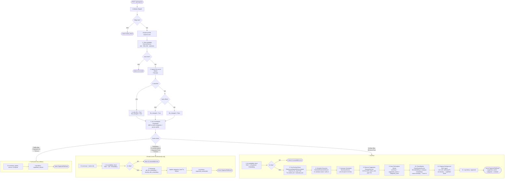
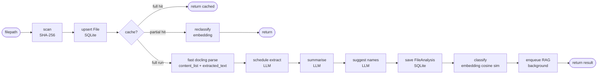

# Organize Flow — Mermaid Flowchart

---

## Core Flow (Happy Path)

---

## หมายเหตุ

- **Lock** ป้องกัน concurrent request บนไฟล์เดียวกัน
- **Fingerprint** = MD5(active category ids+names+descriptions + parser profile) — ใช้ invalidate cache เมื่อ category ถูกแก้
- **RAG enqueue ถูก defer** จนกว่า LLM งานทั้งหมด (schedule/summary/rename/classify) จะเสร็จ เพื่อไม่แย่ง llama-server slot
- ระบบ **ไม่แตะไฟล์จริง** ทั้งหมดเป็น read-only ฝั่ง filesystem
