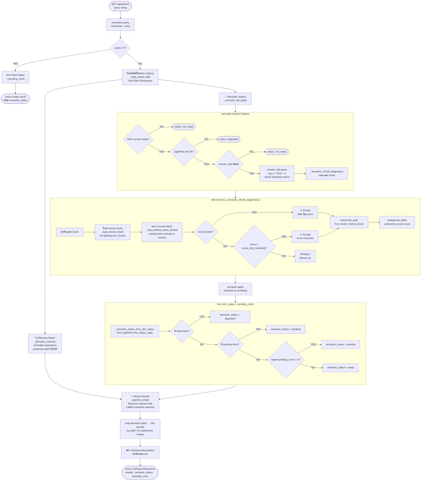
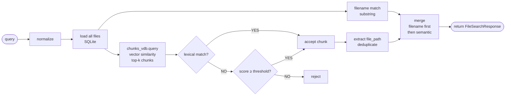
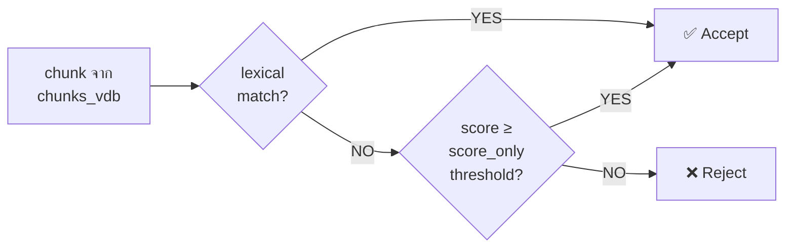

# Search Flow — Mermaid Flowchart

---

## Core Flow (Happy Path)

---

## Chunk Acceptance Logic (ย่อ)

---

## หมายเหตุ

| องค์ประกอบ | ค่า |
|---|---|
| `top_k` | `limit × 3` (เก็บ buffer สำหรับ filter) |
| Lexical match | Ordered phrase match + plural folding (`reports` → `report`) |
| Score threshold | `search_semantic_score_only_min_score` (สำหรับ chunks ที่ไม่มี lexical match) |
| Merge order | Filename matches ก่อน → semantic matches ต่อ (ไม่ซ้ำกัน) |
| semantic_status | `ready` / `pending` / `degraded` / `not_ready` |
